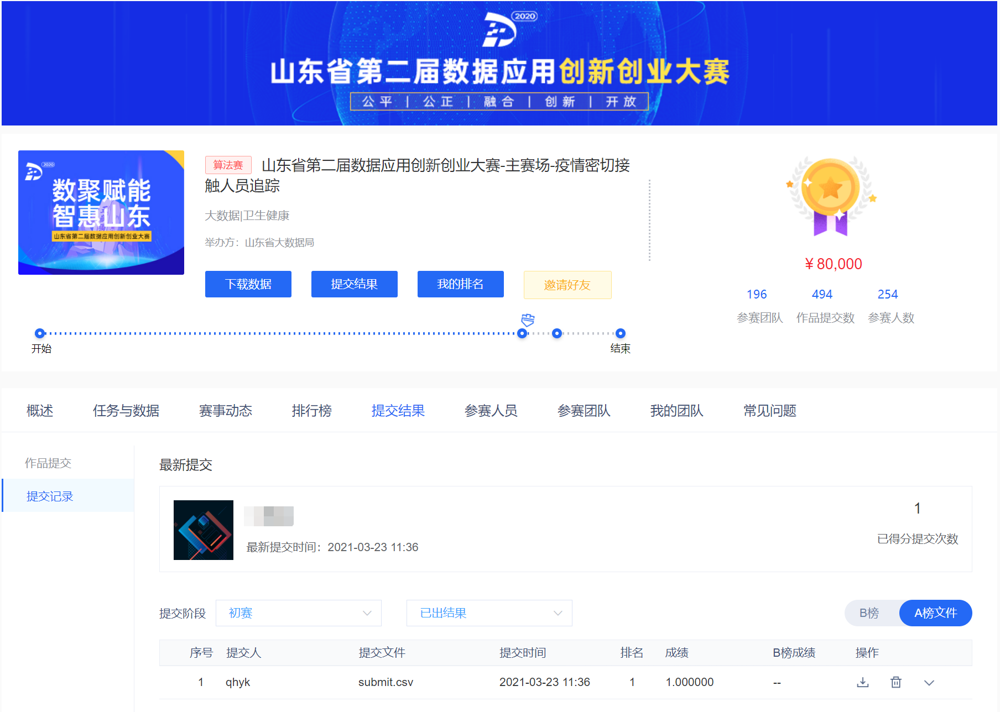

# people_tracking
[山东省第二届数据应用创新创业大赛-主赛场-疫情密切接触人员追踪](http://data.sd.gov.cn/cmpt/cmptDetail.html?id=29)
---
### [时间]
2021/3/23
### [成绩]

### [代码运行时间]
CPU型号是Intel(R) Xeon(R) Gold 5118，运行时间大概1小时，没有继续优化了，有同学想在我这个基础上继续优化的自取。
### [方案说明]
首先找出所有直接接触的记录，将所有接触人员第一次接触后的记录全部标记，再找出所有间接接触记录。
### [可以优化的点]
将每个人的记录按时间顺序排序，如果有接触记录，此后的记录无需再判断。
